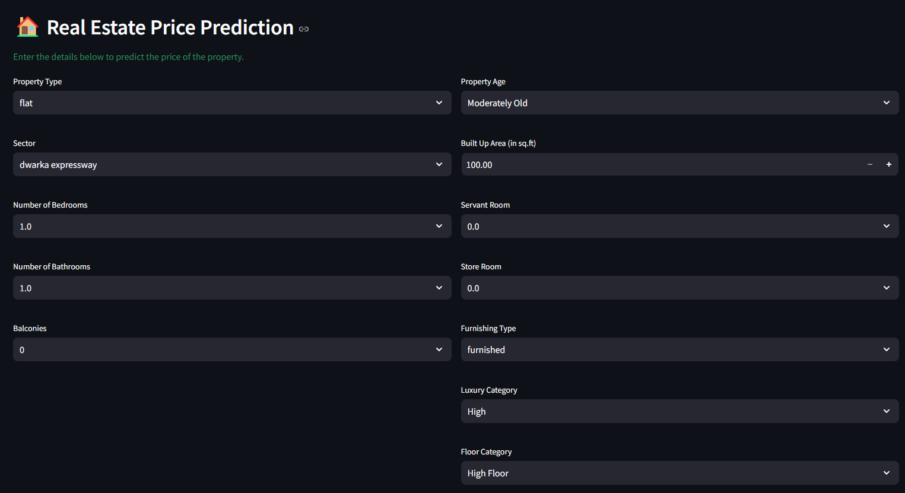
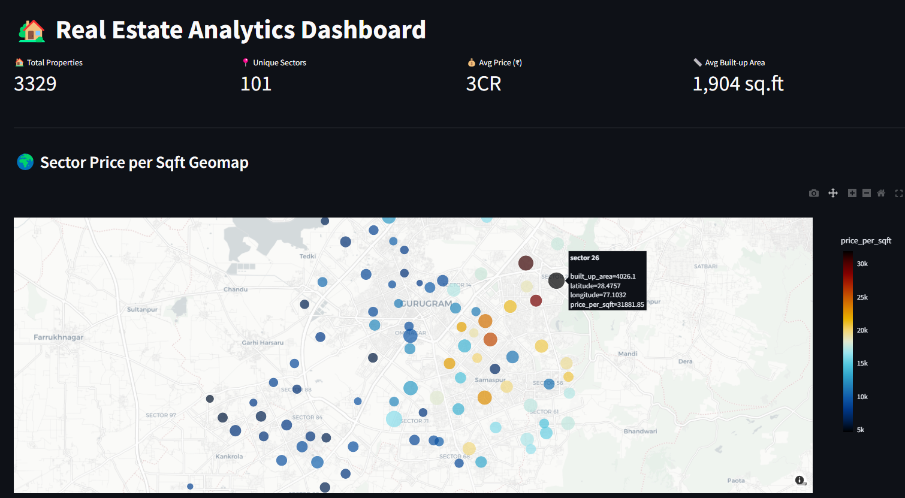
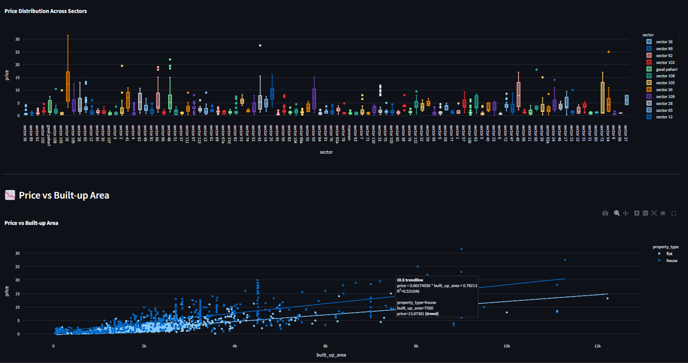
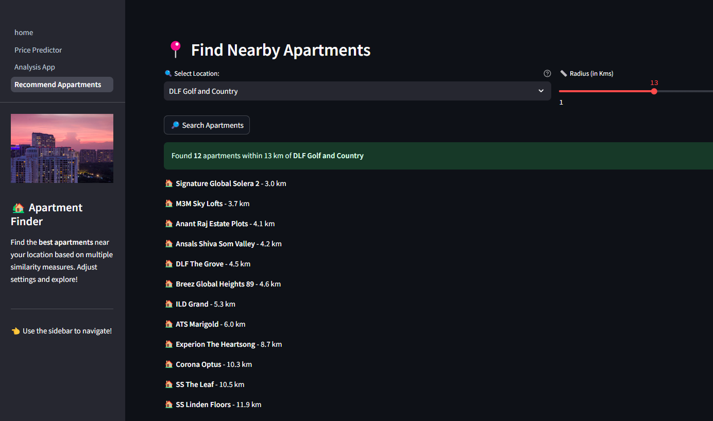
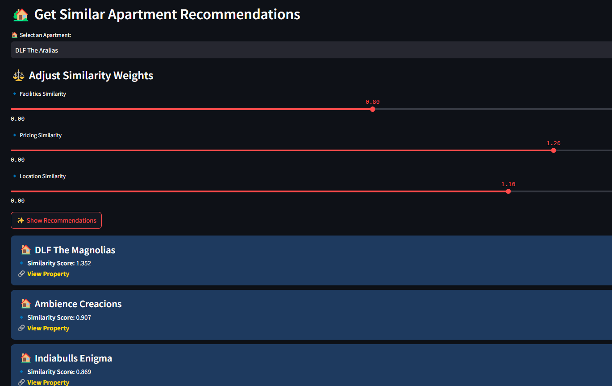

# Gurugram Real Estate Analytics 🏡📊  

## 📌 Project Overview  
The **Gurugram Real Estate Analytics Project** is a **comprehensive data-driven solution** designed to analyze, predict, and recommend real estate properties in Gurugram. This project leverages advanced **machine learning, data visualization, and optimization techniques** to provide actionable insights into property prices and trends.  

### 🔹 Core Modules:  
- **Prediction**: Forecasting property prices using historical data and machine learning models.  
- **Analytics & Visualization**: Interactive dashboards showcasing market trends, insights, and price distributions.  
- **Recommendation**: Suggesting the best properties based on user preferences and data-driven insights.  

---

## 📸 Project Demo  

|  |  |  
|---------------------------------|---------------------------------|  
|  |  |  
|  |  |  

---

## 🚀 Key Features  
✅ **Web Scraping**: Automated extraction of real estate data from multiple sources.  
✅ **Data Cleaning & Preprocessing**: Handling missing values, outliers, and ensuring data quality.  
✅ **EDA (Exploratory Data Analysis)**: Understanding patterns, trends, and distributions using visualization techniques.  
✅ **Feature Engineering**: Creating new features to enhance model performance.  
✅ **TF-IDF & Cosine Similarity**: Used for property similarity recommendations.  
✅ **Column Transformer & Scaling**: StandardScaler & OneHotEncoding for feature transformation.  
✅ **Pandas Profiling & Ordinal Encoding**: Automating data analysis and preprocessing.  
✅ **K-Fold Cross-Validation**: Enhancing model evaluation and validation.  
✅ **Feature Selection**:- **GradientBoostingRegressor**  - **Permutation Importance**  - **Lasso Regression**  - **SHAP (SHapley Additive Explanations)**  
✅ **Dimensionality Reduction**: Implementing **PCA (Principal Component Analysis)**.  
✅ **Model Selection & Training**: Comparing ML models to find the best fit.  
✅ **Bayesian Optimization (Optuna)**: Hyperparameter tuning for optimal performance.  
✅ **Deployment with Streamlit & AWS**: Interactive web app deployed on AWS.  

---

## 📊 Data Pipeline  

1️⃣ **Data Collection**: Scraping property listings, historical prices, and location details.  
2️⃣ **Data Cleaning & Processing**: Handling missing values, encoding categorical data, and standardizing numerical features.  
3️⃣ **Exploratory Data Analysis (EDA)**: Visualizing price trends, feature correlations, and market insights.  
4️⃣ **Feature Engineering & Selection**: Creating new features and selecting the most impactful ones.  
5️⃣ **Model Training & Evaluation**: Experimenting with regression models:  
 - **Linear Regression, Random Forest, XGBoost, LightGBM**  
 - **Support Vector Regression (SVR), Logistic Regression**  
6️⃣ **Hyperparameter Tuning**: Bayesian Optimization with **Optuna**.  
7️⃣ **Feature Selection**: Using **GradientBoostingRegressor, Permutation Importance, Lasso, SHAP**.  
8️⃣ **Dimensionality Reduction**: **PCA** applied for performance improvement.  
9️⃣ **Deployment**: Interactive **Streamlit web application** deployed on **AWS Cloud Services**.  

---

## 🏗 Tech Stack  
🔹 **Python**: Pandas, NumPy, Scikit-learn, BeautifulSoup, Selenium  
🔹 **Machine Learning**: XGBoost, LightGBM, Random Forest, Linear Regression, Multilayer Perceptron, SVR  
🔹 **Feature Engineering**: TF-IDF, Cosine Similarity, Ordinal Encoding, PCA  
🔹 **Hyperparameter Tuning**: Optuna (Bayesian Optimization)  
🔹 **Visualization**: Matplotlib, Seaborn, Plotly  
🔹 **Web Framework**: Streamlit (for deployment)  
🔹 **Data Storage**: CSV, SQLite  
🔹 **Cloud Services**: AWS (EC2, S3, Lambda)  

---

## 📊 Analytics & Visualization  

🔹 **Geospatial Analysis (Geo Maps)**: Property locations, pricing heatmaps, area-wise trends.  
🔹 **Time-Series Analysis**: Animations for price changes over time.  
🔹 **Multi-Map Comparisons**: Side-by-side comparisons of different property zones.  
🔹 **Correlation Heatmaps**: Identifying relationships between key features and property prices.  
🔹 **3D Visualizations**: Interactive 3D graphs for property distribution.  

These visualizations enhance real estate market understanding and data-driven investment decisions.  

---

## 📈 Results & Insights  

✅ **High Accuracy**: Achieved a strong **R² score** with optimized ML models.  
✅ **Market Trends**: Identified key factors influencing property prices in Gurugram.  
✅ **Optimized Recommendations**: Personalized property suggestions using **Cosine Similarity**.  

---

## 📌 How to Run the Project  
```bash
# Clone the repository  
git clone https://github.com/AbhaySingh71/99acres-Real-Estate-Analytics.git  

# Navigate to the project directory  
cd 99acres-Real-Estate-Analytics  

# Install dependencies  
pip install -r requirements.txt  

# Run the Streamlit app  
streamlit run app.py  

```
---  

## 🌐 Deployment on AWS  
The project is deployed on **AWS Cloud Services** to ensure high availability and scalability. The following services are utilized:  

🔹 **EC2**: Hosting the Streamlit application.  
🔹 **S3**: Storing dataset files and model artifacts.  
🔹 **Lambda**: Handling backend processing tasks. 

---  

## 🤝 Contributing  
Contributions are welcome! If you have suggestions or improvements, feel free to **fork the repository** and submit a **pull request**.  

---  

[](https://www.linkedin.com/in/abhay-singh-050a5b293/)

[](https://x.com/@abhaysingh71711)  

---  

🚀 **Empowering smarter real estate decisions with data-driven insights!** 🏡📊  

#DataScience #MachineLearning #RealEstateAnalytics #AWS #HappyLearning 😊
